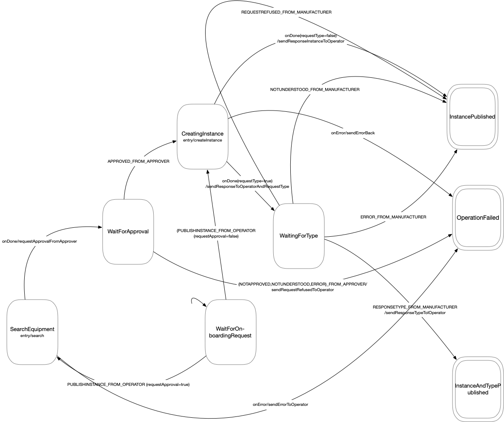

# Onboarding-skill

## Configuration

Service configuration is handled via environment variable injection. Within the `env_file:` section of `docker-compose.yml` you find a list of _.env_-files mounted. The corresponding default configurations and explanations are located in: `.compose-envs/<SERVICE-NAME>.env`. [server.ts](src/server.ts) contains all environment variables that need to be set.

## Running

- To start: `npm run dev` from this directory
- A GET on `localhost:3000/health` returns a "Server Up!"

## The big picture

.

## The state machine

This component uses [xstate](https://github.com/davidkpiano/xstate). The modelled state machine is shown below: 

The machine is defined [here](src/services/onboarding/SkillStateMachineSpecification.ts).

From each state, invalid messages will be responded to (as long as they are parsable and contain a proper sender) with notUnderstood.

## Developer notes

### Main classes:

- `AssetRepositoryOnboardingSkill`: the heart of the business logic.
- `SkillStateMachineSpecification`: the specification of the state machine from the diagram.
- `SkillActionMap`: maps actions from the state machine to calls on the MessageDispatcher (transitions result in sending of messages )
- `IMessageDispatcher/MessageDispatcher`: high-level interface for all message sending from the state machine
- `DeferredMessageDispatcher`: a message sender that allows you to collect messages with the CommandCollector) and send them with a commit action (used to avoid the state machine sending non-error messages in case the e.g. a database write error occurs after a transition has taken place)
- `WebClient`: low level HTTP messaging interface
- `AMQPClient`: low level AMQP messaging interface
- `IMessageSender/MessageSender`: high-level AMQP messaging interface
- `MessageInterpreter`: converts received AMQP messages to events to be applied to the state machine.
- `SimpleMongoDbClient/IDatabaseClient`: MongoDB interface

### How it works

A message is received via the message broker (AMQPClient -> MessageInterpreter) and converted into an event, which is then passed on to the main domain class AssetRepositoryOnboardingSkill. This loads a state from persistent storage, (according to the conversation id), into the state machine and applies the event to it, writing the state back to persistent store. The transition of the state machine causes messages to be sent. This mapping is specified in SkillStateMachineSpecification.

### Tests

#### Unit Tests

- Run unit tests using `npm run test`
- Run unit tests with coverage with `npm run coverage`

#### Including integration tests

These tests require a message broker and the AMQP_URL variable set in the environment to the host name of the message broker (in the docker container) with the exposed 5672 port, for example: "localhost", if running the tests locally. The message broker for the integration needs to provide default guest user account for the tests to run.

It can be run from a docker image with `source .\integration-test-setup` (wait 20s before starting integration tests).

- To run integration tests as well: `npm run test-with-integration`
- To run coverage with integration tests: `npm run coverage-with-integration`
  To cleanup the message broker `.\integration-test-teardown`
