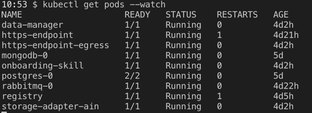
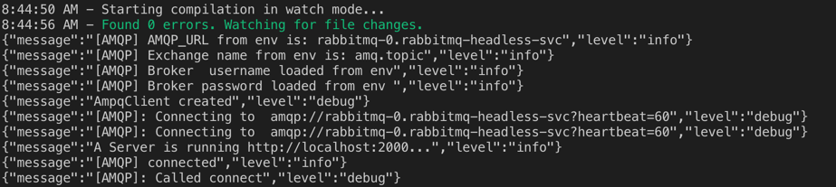
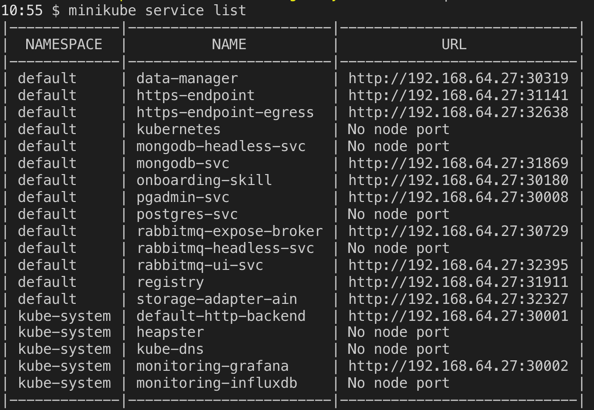

# HowTo: Run the AAS Service on a local cluster

## Prerequisites
The following components need to be installed:
- [minikube](https://kubernetes.io/docs/tasks/tools/install-minikube/) (v0.35.0 & hypervisor e.g. [hyperkit](https://github.com/moby/hyperkit)(v0.20180403-17-g3e954c) for mac)
- [kubectl](https://kubernetes.io/docs/tasks/tools/install-minikube/#install-kubectl) 
- [docker](https://runnable.com/docker/getting-started/) (tested with v2.0.0.3)

For Mac, most of these (despite from Docker🐳) can be installed via [homebrew🍺](https://brew.sh/):
```bash
# Install docker first, then:

# kubectl
$ brew install kubernetes-cli
# hyperkit
$ brew install docker-machine-driver-hyperkit
# minikube
$ brew cask install minikube

```

## Setup local Kubernetes cluster
Once all components are installed the local cluster can be set up. If a local minikube setup already exists it is suggested to purge it via `minikube delete`. Once the slate is clean, start by creating the cluster (Adjust memory and CPU according to your machine):
```bash
$ minikube start \
      --memory=8192 \
      --cpus=4 \
      --vm-driver=hyperkit

😄  minikube v0.34.1 on darwin (amd64)
🔥  Creating hyperkit VM (CPUs=4, Memory=8192MB, Disk=20000MB) ...
📶  "minikube" IP address is 192.168.64.11
🐳  Configuring Docker as the container runtime ...
✨  Preparing Kubernetes environment ...
    ▪ kubelet.authentication-token-webhook=true
    ▪ kubelet.authorization-mode=Webhook
    ▪ scheduler.address=0.0.0.0
    ▪ controller-manager.address=0.0.0.0
💾  Downloading kubeadm v1.13.2
💾  Downloading kubelet v1.13.2
🚜  Pulling images required by Kubernetes v1.13.2 ...
🚀  Launching Kubernetes v1.13.2 using kubeadm ...
🔑  Configuring cluster permissions ...
🤔  Verifying component health .....
💗  kubectl is now configured to use "minikube"
🏄  Done! Thank you for using minikube!
```

Proceed by ensuring kubectl is configured to minikube context:
```bash
$ kubectl config current-context
minikube
```

## Setup services

Once the cluster is ready to go, from the root of the repo, run
```
kubectl apply -f helm/kubernetes/
```
Watch for the creation of the pods via: 
```
kubectl get pods --watch 
```
until the `rabbitmq-0`, `mongodb-0` and `postgres-0` pods are `Running`.

## Local testing with minikube 
How to run a smoke test with the installation locally with minikube:

1. Install and Start minikube (See above commands. Important to allocate at least 4 Gb of RAM).Test deployment with: ```minikube status```. Note: VPN sometimes interferes with Minikube's networking. If deployment hangs, try deactivating VPN
2. Run the commands for setting up the services (see above)
3. In order to start the Apps, go to the folder of each of the respective App in `helm/`, e.g. `helm/onboarding-skill/` and apply the kubernetes yaml file there.  
!NOTE: You'll have to remove the `SHA-PLACEHOLDER` image tag. 


## Monitoring with minikube

1. Execute the steps above. Starting all Apps and Running a ```kubectl get pods --watch ``` should yield: 
   
   

2. To get the logs of an app run:
```kubectl logs [pod name] ```, or a running log using ```kubectl logs [pod name] -f```:
For instance the ```kubectl logs https-endpoint ``` returns
    
   

3. To see how the apps and services can be accessed outside the K8s Cluster run 
   ```minikube service list```
   This should return a list of the addresses and ports:
   
   

   These service addresses can be used for accessing the management services like pgadmin, mongodb or rabbitmq-management-ui
