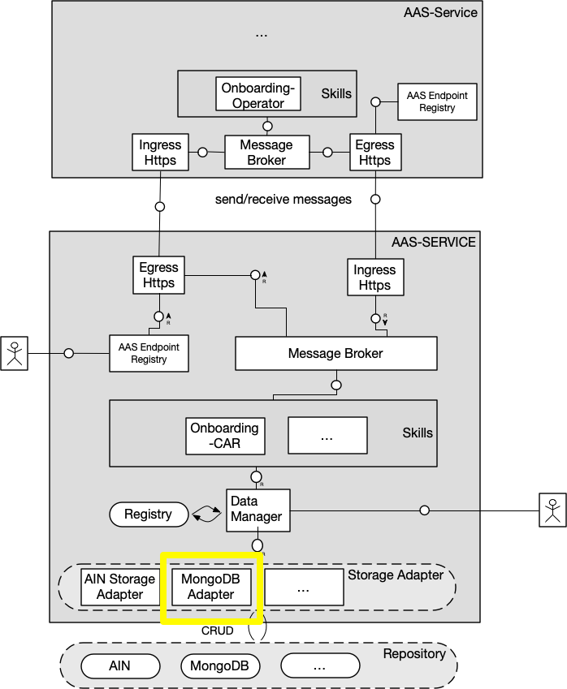

# storage-adapter-mongodb

## Configuration
Configuration is handled via environment variables. In the `environment:` section of the container in `docker-compose.yml` is a full list of environment variables, some of which can be configured via the `.env` file located in the repository root.

## Running

- To start: `npm run dev` from this folder
- A GET on `localhost:3100/health` returns a "Server Up!"
- A POST on `localhost:3100/submodels` with [the sample input](./opcua-submodel-instance.json) should result in a submodel created in the database.
- A GET on `localhost:3100/submodels` returns the list of submodels in the database.
- A DELETE on `localhost:3100/submodels/{_id}` deletes a submodel in the database.

## The big picture

## Developer notes

#### Implementation

### Unit Tests

- Run unit tests using `npm run test`
- Run unit tests with coverage with `npm run coverage`
