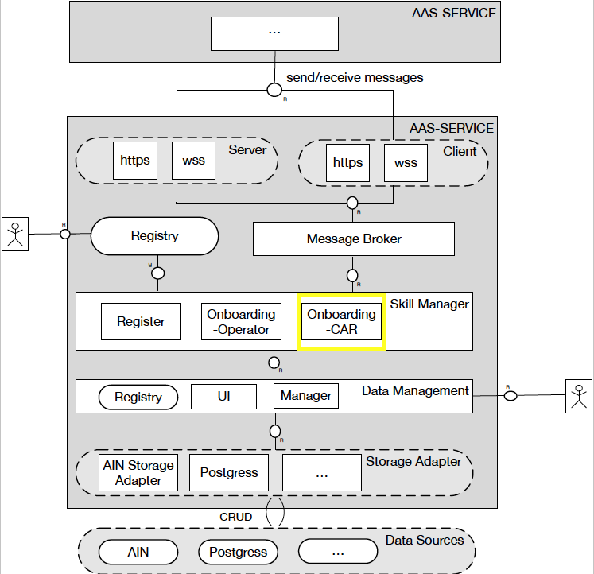
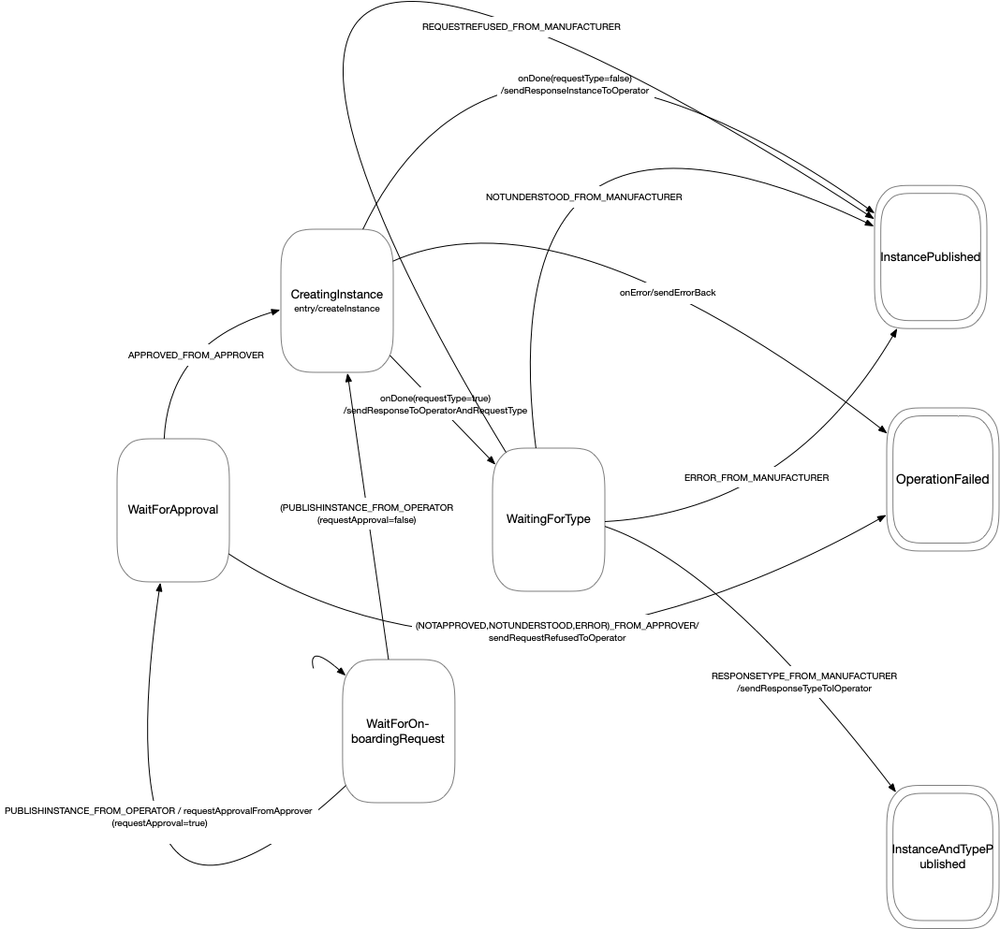

# onboarding-skill

## Running

- To start: `npm run dev` from this directory

## The big picture

.

## The state machine

This component uses [xstate](https://github.com/davidkpiano/xstate). The modelled state machine is shown below: 

The machine is defined [here](../../src/ts/cmd/onboarding-skill/src/services/onboarding/MySkillStateMachineSpecification.ts).

From each state, invalid messages will be responded to (as long as they are parsable and contain a proper sender) with notUnderstood.

## Developer's note

### How it works

A message is received via the message broker (AMQPClient -> MessageInterpreter) and converted into an event, which is then passed on to the main domain class AssetRepositoryOnboardingSkill. This loads a state from persistent storage, (according to the conversation id), into the state machine and applies the event to it, writing the state back to persistent store. The transition of the state machine causes messages to be sent. This mapping is specified in SkillStateMachineSpecification.

### Tests

#### Unit Tests

- Run unit tests using `npm run test`
- Run unit tests with coverage with `npm run coverage`

#### Including integration tests

Test setup can be done with `source ./integration-test-setup` (wait 20s before starting integration tests).

- To run integration tests as well: `npm run test-with-integration`
- To run coverage with integration tests: `npm run coverage-with-integration`

Test cleanup: `./integration-test-teardown`

# Writing your own skill

You may use the onboarding skill as a template to write your own skill.

- The first thing to do is to create a state chart as above.

  _About the notation:_ The state chart notation is described in this [paper](http://www.inf.ed.ac.uk/teaching/courses/seoc/2005_2006/resources/statecharts.pdf): States are shown as rectangles with rounded edges, final states have double borders. Transistions are shown by arrows. The notation on the arrows is: event-to-move-out-of-state (condition-under-which-to-execute-transition)/transition-action-to-be-executed-while-transitioning. Actions can also be triggered on entering or exiting states. This is indicated in them being written inside the state "rectangle" in small font. Events received from other parties are concatenated as following: {message type}_FROM_{sender role} (all caps). When an external rest service is called it needs to be modelled as a [service](https://xstate.js.org/docs/guides/communication.html#the-invoke-property) with its own sub-states.

- Understand how the above diagram maps to its [skill state machine specification](../../src/ts/cmd/onboarding-skill/src/services/onboarding/MySkillStateMachineSpecification.ts) created using [xstate](https://github.com/davidkpiano/xstate). This way you create your own _MySkillStateMachineSpecification.ts_, replacing the one for the onboarding skill in the corresponding folder.

- Create a _MySkillActionMap.ts_ containing the code for actions to be performed when the state machine moves through the states. These actions can be messages sent to other parties in an AAS interaction or the invocation of external services. The methods you provide here depend on your scenario. This class should make use of a _MyExternalRestServiceCaller.ts_ to make the actual calls to the external services as well as a _MyAasMessageDispatcher.ts_ that uses the [message sender](../../src/ts/cmd/onboarding-skill/src/base/messaging/MessageSender.ts) to send messages via the message broker. _MyAasMessageDispatcher.ts_ needs to implement at least the interface [IAasMessageDispatcher](../../src/ts/cmd/onboarding-skill/src/base/messaginginterface/IAasMessageDispatcher.ts). You may have a look at the [corresponding files](../../src/ts/cmd/onboarding-skill/src/services/onboarding) for the onboarding skill and replace them.

- Finally, provide a _MyInitializer.ts_ that provides these two communication classes and a configuration object that is later placed in the context for your state machine to use. This configuration object contains configuration properties your state machine requires. You may have a look at the [corresponding file](../../src/ts/cmd/onboarding-skill/src/services/onboarding/MyInitializer.ts) for the onboarding skill and replace it.

Please note that the state machine is an interation state machine. It deals with events (incoming messages or results of REST calls) and performs actions (sending messages, making REST calls) thereby moving to a new state. It does not know about business logic unrelated to messaging. Only model the interaction in it. If you have a scenario with multiple AAS services (with skills in them) communicating with each other you will need to perform this process for all involved parties. Each will result in a microservice that is deployed as a skill in each instance of the AAS services involved in the interaction.
